# Concurrent Binary Search Tree
Here is the PDF version of [project proposal](./Project_Proposal.pdf).
Here is the PDF version of [milestone report](./Milestone_Report.pdf).
Here is the PDF version of [final report](./Final_Report.pdf).

## SUMMARY
We want to implement 3 - 4 concurrent version of binary search tree (BST) data structures, including BST protected by single coarse-grained lock, fine-grained lock protected BST, lock free version BST and a transactional memory version BST if we have time. We will do experiments and measure the performance of each version on different workloads and concurrent thread count to analyze the pros and cons of each implementation and compare their performance.

## BACKGROUND
A binary search tree (BST) is a data structure which allows data to be searched, find, and delete with a time complexity O(log(n)). In a BST, the most important property is that a parent node will always have key larger than the key of its left sub-tree and smaller than the key of its right sub-tree.  Three operations are supported in BST, insertion, deletion, and searching. When inserting, the location where the new node will be inserted need to guarantee that the property of BST still holds. After deletion, the BST may need to be adjusted to make sure the property still holds. In BST, data can be stored with hierarchies so that the modification to one sub-tree would not affect other sub-trees, though the structure of current sub-tree may be changed.

Binary search trees have lots of applications. Sorting can be performed using a binary search tree by inserting all elements and then perform in-order traversal. Another important application is database, which can use B-tree to sort data. Although not exactly using BST, B-tree is just a generalization of BST allowing each parent node having more than two child nodes. We want to implement concurrent BST because as long as BST supports concurrency, the applications of BST can explore parallelism, so the potential benefits can be large. We want to compare different implementations of concurrent BST to know what is the most efficient implementation or which implementation is the most suitable for a certain workload pattern so that the applications of BST can choose the best implementation to speedup more when parallelized.

## THE CHALLENGE
One of the most important problems to be solved when using concurrent data structures is how to ensure the data integrity when multiple threads are trying to access or modify the same part of the data structure. Solving this problem can be challenging in binary search tree since deleting a node will not only impact the node itself, its parent node and its children node. The structure of the sub-tree containing that node may be affected since in binary search tree since we need to maintain the correct order between a parent node and its left and right child node. When using different methods to ensure the data integrity, efficiency is also needed to be considered and can be another challenging part. The overhead of operations used to maintain data integrity must not over-shade the speedup brought by parallelization. Potential problems brought by locks and concurrency, such as deadlock, must be dealt with, which may also be challenging.

Another possible challenging part in our project is how to generate different workloads for experiments. It is likely that a certain version of concurrent BST perform better than other versions when using a particular workload pattern (e.g. more inserts than deletes). If we want to explore the pros and cons of each version, we may need to come up with a few workload patterns, which may be challenging.

## RESOURCES
We found three papers relate to fine-grained lock protected BST, lock free version BST, and transaction memory BST.

Kung, H. T., & Lehman, P. L. (1979). Concurrent manipulation of binary search trees . Carnegie-Mellon University, Dept. of Computer Science.

Natarajan, A., & Mittal, N. (2014). Fast concurrent lock-free binary search trees. SIGPLAN Notices, 49(8), 317–328. https://doi.org/10.1145/2692916.2555256

Bronson, N. G., Casper, J., Chafi, H., & Olukotun, K. (2010). A practical concurrent binary search tree. SIGPLAN Notices, 45(5), 257–268. https://doi.org/10.1145/1837853.1693488

We will use GHC machines and PSC machine. We plan to implement different versions of BST and verify their correctness on GHC machines. To test their performance when using different number of threads, we may need to use PSC machine as it has more cores. Tests on how different workload affects the performance of different versions of BST will probably be carried on GHC machines as well.

## GOALS AND DELIVERABLES
### Plan to achieve
- Implement the tree with coarse-grained lock supported
- Implement the tree with fine-grained lock supported
- Implement the tree without locking mechanism
- Implement the tree with software transaction memory supported
- Generate different insertion and deletion workloads
- Verify the correctness of three implementations
- Carry out experiments on different implementations of BST with different thread count and workloads
- Analyze performance, pros and cons of each BST implementation

In order to verify the correctness, we want our data to be consistent before and after a group of manipulations. Also, we do not want deadlocks appear in our implementation, we would have a timeout mechanism to detect whether deadlock happens. All details about these concurrent trees have been specified in papers that we found. Therefore, we are confident that we can implement them.

### Hope to achieve
If we are on the right track, and finish above features earlier, we would like to add

- fine-grained tree balancing
- lock-free tree balancing
- STM tree balancing

However, if we did not have enough time to implement all 4 trees, we want first 3 of 4 tree implementations to be done, i.e. BST protected by coarse-grained lock, fine-grained lock, and lock-free BST.

### What to show
We plan to show several speedup graphs during our post session. The speedup graphs will be about Speedup of different BST implementations vs. thread count when using different workloads. There will be one graph for each workload.

These speedup graphs can help people know which BST performs best under different scenarios.

### Expectations
Either fine-grained concurrent BST, lock-free BST, and STM BST implementations should perform better in speedup than coarse-grained concurrent BST, as well as the sequential version of BST manipulations. Different insertion, deletion, searching workloads may lead to different implementations outperforming others.

## PLATFORM CHOICE
We are going to use C++ to implement our data structures. Our team members are more experienced with using C/C++ rather than some high-level languages like Java, Python, and etc. Also, C++ allows us to manage memory on our own, and this is usefull when the paper explicitly specifies an garbage collection mechanism.

## SCHEDULE
| Week | Date | Tasks | Done |
| --- | --- | :-: | :-: |
| 1 | 11.1 - 11.7 | Proposal   Literature review   Coarse-grained lock version BST | Yes |
| 2 | 11.8 - 11.14 | Fine-grained lock version BST   Lock-free version BST | Yes |
| 3 | 11.15 - 11.21 | Lock-free version BST   Transactional memory version BST   Milestone report | Yes |
| 4 | 11.22 - 11.28 | Transactional memory version BST   Experiment workload generation | Yes |
| 5 | 11.29 - 12.5 | Experiments and analysis | Yes |
| 6 | 12.6 - 12.10 | Final report   Poster | Yes |

## Checkpoint
### Schedule
We are behind schedule for the time being.  Part of the reason is that we just had exam, and we did not take itinto consideration when making the schedule.  However, the main reason is that we met the problem of safe releaseof memory.  When erasing a node, we cannot immediately release the memory of the node because there may beother threads accessing the memory.  The paper we referenced did not describe how to do garbage collection indetail.  Locking the whole tree and do garbage collection periodically will hurt performance too much.  We alsotried using smart shared pointer in C++, but it is too expensive, and thus it also hurts the performance a lot.We decided to implement the hazard pointer method, which will be implemented earlier next week.  We adjustedour schedule, and implementing the transactional memory version of BST will be a depending task depending onour future progress.

### Summary
We have finished literature review about fine-grained, lock-free, and transactional memory versions of BST. Wehave implemented the coarse-grained lock version BST. It is based on the simple single-thread BST and addinga lock for the whole tree.  We have implemented the fine-grained lock version BST. It is mainly based on theidea  of  hand-over-hand  lock.   For  the  erase  operation,  the  paper  we  referenced  adopted  the  method  to  rotatethe node to be erased to leaf position if it is not at the first place so that the tree may be more balanced andbenefit future operations on tree.  We have finished implementing the basic operations while releasing memoryonly when destructing the tree due to the safe memory release problem caused by multiple threads.  However,this implementation cannot scale to support 100,000 erases.  Therefore, we have been seeking ways to resolve thesafe memory release problem, and decided to implement hazard pointer.

### Goal and Deliverable
#### Plan to achieve
- Implement the tree with coarse-grained lock supported
- Implement the tree with fine-grained lock supported
- Implement the tree without locking mechanism
- Generate different insertion and deletion workloads
- Verify the correctness of three implementations
- Carry out experiments on different implementations of BST with different thread count and workloads
- Analyze performance, pros and cons of each BST implementation

#### Hope to achieve
- Transactional memory based concurrent tree implementation
- Fine-grained tree balancing
- Lock-free tree balancing

We have reached the first goal and almost reached the second goal.  We also achieved the fifth goal for coarse-grained lock and current fine-grained lock versions of BST. We moved the goal to implement the transactionalmemory version BST to hope to achieve goal since we spent more time on solving the safe memory release problem.We also achieved the fine-grained tree balancing goal in the hope to achieve goals to some extent.  The algorithmof erasing we chose for fine-grained tree is to keep rotating the tree until the node to be erased is a leaf node.Rotating will likely balance the tree, although the balancing may not be perfect since we are not rotating basedon height difference.

#### What to show
We plan to show several speedup graphs during our post session.  The speedup graphs will be about Speedupof different BST implementations vs.  thread count when using different workloads.  There will be one graph foreach workload.  These speedup graphs can help people know which BST performs best under different scenarios.

### Preliminary Results
When deciding whether we can use C++ smart shared pointer to resolve the safe memory release problem, we tested time needed for the fine-grained lock BST implemented by shared pointer to insert and search 100,000 different elements, and the result is 2.42 seconds. We then tested time needed for the coarse-grained lock BST to insert and search 100,000 different elements, and the result is 1.542 seconds. Therefore, we found out that shared pointers are too expensive to use and will hurt the performance so bad that the fine-grained lock BST will even be slower than the coarse-grained lock BST. We think the reason is that shared pointer objects will need to maintain the reference count of the memory location. When different threads are accessing the same memory location, the reference count will be read and written by different threads, causing frequent invalidations to maintain cache coherence and much internal communication traffic, so the overhead of using shared pointers is very high. Therefore, we decided that we cannot use shared pointer, but will implement the hazard pointer method.

### Concerns
The main concern we have now is how to implement hazard pointer efficiently. The hazard pointer will be used both in fine-grained lock BST and lock-free BST, and after implementing it, we think we can adjust fine-grained lock BST and implement lock-free BST quite quickly.

## Final
### Summary
We implemented 3 concurrent versions of binary search tree (BST) data structure, including single coarse-grained lock protected BST, fine-grained lock protected BST, and lockfree BST. We compared the performance of different concurrent BSTs when running different operation pattern with different tree size and thread numbers.

### Approach
C++ is used to implement solutions. STL mutex and atomic variables are used to ensure code is executed correctly in critical sections. Trees are implemented as template classes, and they are able to support all customized structures. But for the simplification, some of our operations only focused on integers and trees are not guaranteed can be used on types besides integers. We define the correctness of concurrent BST as insertion/deletion should not affect the traversal of other nodes in the tree.
#### Coarse Grained BST
This is the most basic BST. Find, insert, and erase are synchronized by using the single mutex. No two operations can be executed at the same time.
#### Fine Grained BST
The algorithm is implemented based on [1] in the reference section.
##### Find
The traversal is similar with the general BST. However, once the target is found, the algorithm checks whether the target is still the child of the parent node before it gets returned to avoid returning the node which has been slipped away. If this condition is met, the traversal will start from the parent of the child to find for the target again. Once the target is found, the parent node is locked to avoid other processes change the connection between the parent and the target node. If the target is not found, it returns the parent and the direction where the target should be appended to. Two routines are implemented for this step. One is a helper function which acts as the dependency for insert and erase functions. Another is the public find function for checking whether the target exists in the tree, and this functions will call the helper function to retrieve the result, and it will be responsible for releasing the lock of the node to allow other operations to make modifications to it.
##### Insert
Insert relies on find. The routine calls find to retrieve the parent node and the direction where the new node should be inserted to. At this point, the parent is locked and wait for modifications. Then the algorithm simply connect the new node to the parent and release the lock.
##### Rotation
The rotation operation is needed to perform the deletion. While the rotation is performed, the original structure is not modified. Instead, the algorithm makes copies of rotated nodes and inject these nodes after the rotation into the tree so that other operations can still traverse in the right order before the rotation operation is done. While the rotation is being performed, edges which need to be changed are synchronized by using locks.
##### Erase
Erase relies on the find and rotation operations. The algorithm first use find to locate the node. Then it tries to rotate the node which needs to be removed until the node have only one incoming edge and one outgoing edge. Then the node’s parent will be reconnected with node’s child to make the node disappear from the tree. Modifications to the parent node will be synchronized using the lock. Since it could be possible that other operations are trying to access the erased node, we could not free this node immediately. Instead, we would mark the node as freed, and have a back pointer to point to the original parent of the node and make other operations to resume from that point. And the node which needs to be freed will be pushed to the retire list which is local to each thread.
#### Lock Free BST
The algorithm is implemented based on [2] in the reference section. Lock free tree gets rid of locks. Instead, it uses C++ atomic class to ensure edge modifications are atomic. One property of this tree is that all data are stored on leaves. Two bits are taken from node address to indicate whether the edge between parent and child is being erased.
##### Seek
The algorithm traverses the tree until it encounters a leaf which holds the same value as the key. If the key does not exist, the seek function returns the leaf whose key is most likely to match with the given key.
##### Find
The function simply check whether seek function returns a node whose key is same as the given key.
##### Insert
Insert operation first calls seek to find the location where the node should be inserted to. If the key has existed, nothing will be done. If the key does not exist, two new nodes will be created in this step. One node is the internal node, another node will be the leaf which stores newly added key. The reason to have the internal node is to make the actual data store on the leaf. The key of the internal node will be the maximum among the old leaf key and the new key. Then the old leaf and the new leaf will be inserted to left and right of the internal node based on their key values.
##### Erase
As oppose to insert operation, the erase operation removes two nodes for each call. One node is the internal node, and another node is the leaf node which stores the key. In this case, we call the leaf node which needs to be removed as child, and the other child of the internal node will be called as sibling. ”Flag” bit is used for marking the edge between internal node and the child is being modified. ”Tag” bit is used for marking the edge between internal node and the sibling is being modified. Erase operation simply reconnect the parent of the internal node to the sibling. Therefore, the internal node and the leaf is isolated from the tree.
#### Garbage Collection
Nodes which are being accessed by other operations cannot be freed immediately. Instead, we have a local retire list for each thread. When one node needs to be freed, it gets pushed onto this list. When the size of the list exceeds a threshold value, the garbage collection routing will wait until current read and write operations complete and block all later operations get executed. Once the previous reads/writes finish, GC starts executing. It would try to free all nodes in the local retire list. Once GC completes its work, it gives away the permission and let later operations keep executing their works. By having an global lock and a read/write counter, this mechanism can be implemented easily.
### Results
#### Experiment Setup
We conducted experiments on Pittsburgh Supercomputing Cluster (PSC) under shared memory mode. The technical specifications are listed below:
- CPU: 2x AMD EPYC 7742 (2.25-3.40 GHz, 2x64 cores per node)
- RAM: 256 GB
- Cache: 256 MB L3 cache, 8 memory channels
- Local Storage: 3.84 TB NVMe SSD
To compare the performance of each BST implementation, we measured the time each BST implementation needed to finish the program under the same experiment setting. To compare the performance of different versions of BST under difference circumstances, we conducted experiments with the following three parameters:
- Number of threads. We conducted experiments using 1, 2, 4, 8, 16, 64, 128, and 256 threads. The number of threads used is related to the degree of parallelism and also the degree of contention [2].
- Operation patterns. We carried out experiments using 7 different operation patterns, as listed below:
  1. Pure insert. Only insert operations are performed and timed.
  2. Pure erase. After inserting some data, then only erase operations are performed and timed.
  3. Pure search. After inserting some data, then only search operations are performed and timed.
  4. Contention simulated. Multiple threads will try to perform insert, erase, and search operations on same nodes concurrently. All operations are timed.
  5. Write dominance. 50% operations are insert operations and 50% operations are erase operations. Both operations are modifying the tree.
  6. Mixed. 20% operations are insert operations, 20% operations are erase operations, and the other 60% operations are search operation. The pattern is a most likely pattern in daily use of BST.
  7. Read dominance. 10% operations are insert operations and 90% operations are search. This pattern mainly reads the tree instead of modifying the tree.
  The last three patterns are developed from the idea in [2].
- Problem size. The problem size can be an important factor in parallelizing problem. In our experiment, we use 25,000, 50,000, 75,000, and 1,000,000 tree nodes to explore the impact of problem size.

#### Experiment Results
We timed each experiment, and plot bar plots of time to compare the performance of each implementation of binary search tree. We selected results of using 1 thread, 64 threads and 256 threads to be presented here. Results using other thread numbers are similar to result of 64 threads and 256 threads.
|1 thread | 64 threads | 256 threads|
:-------------------------:|:-------------------------: | :-------------------------: |
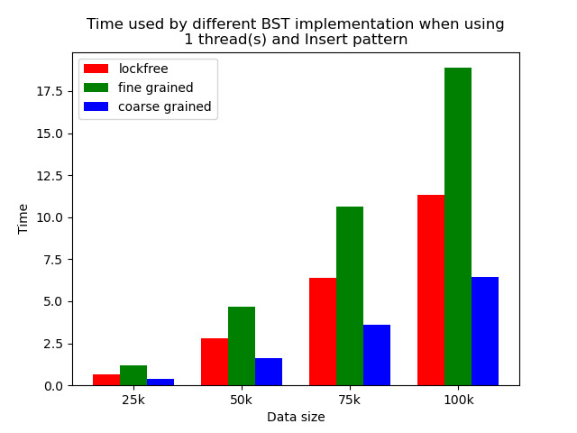  |  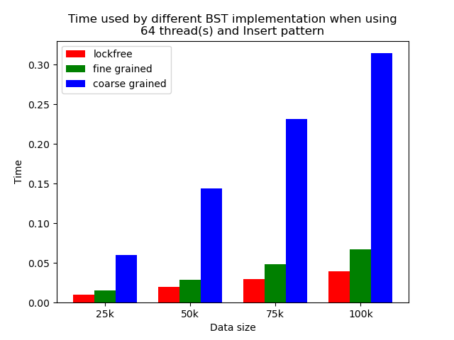 |  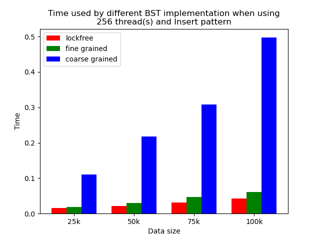 |
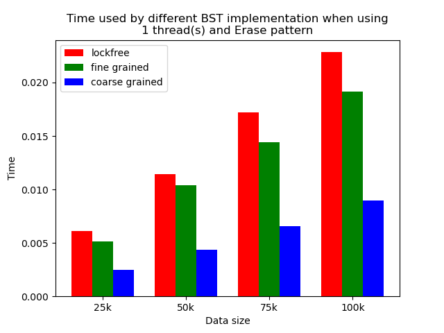  |  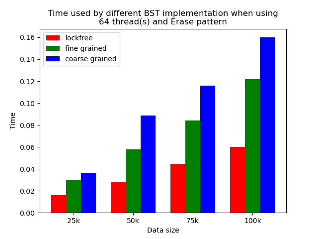 |  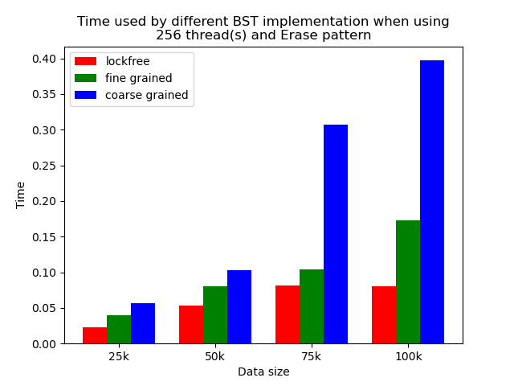 |
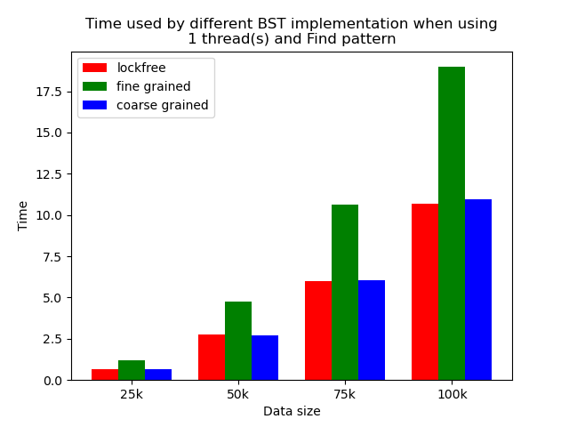  |  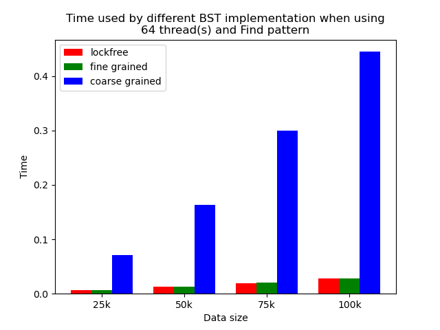 |  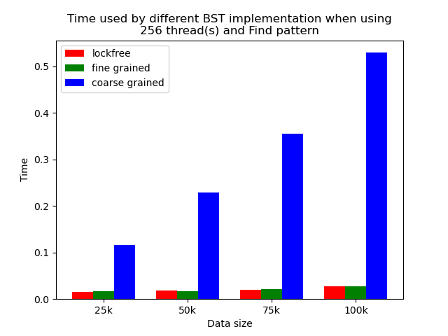 |
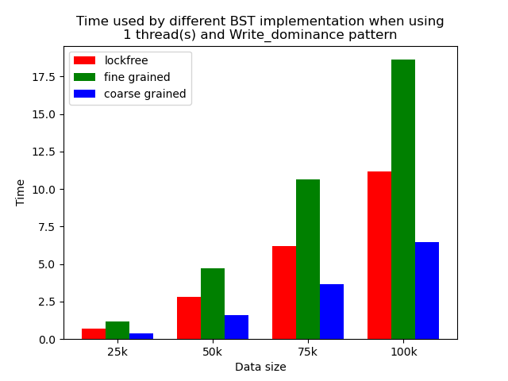  |  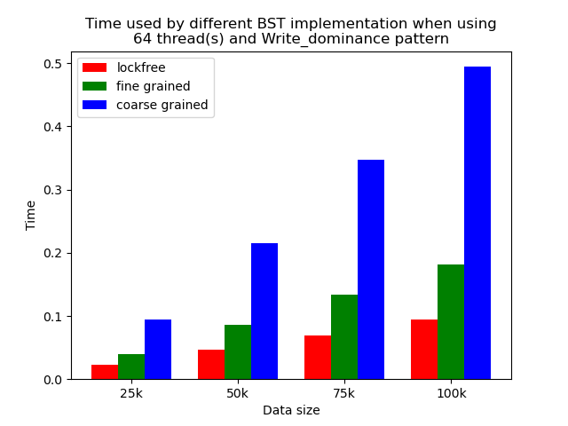 |  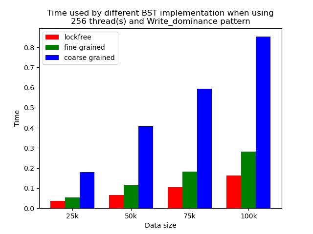 |
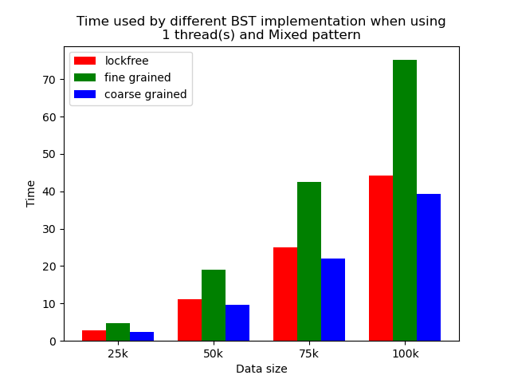  |  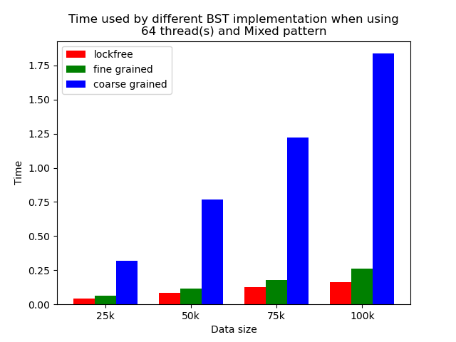 |  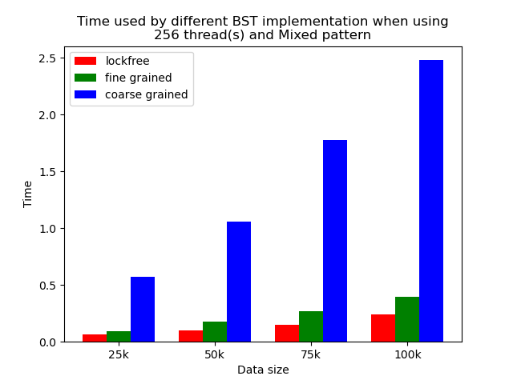 |
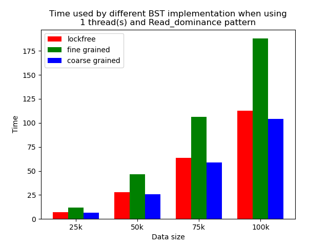  |  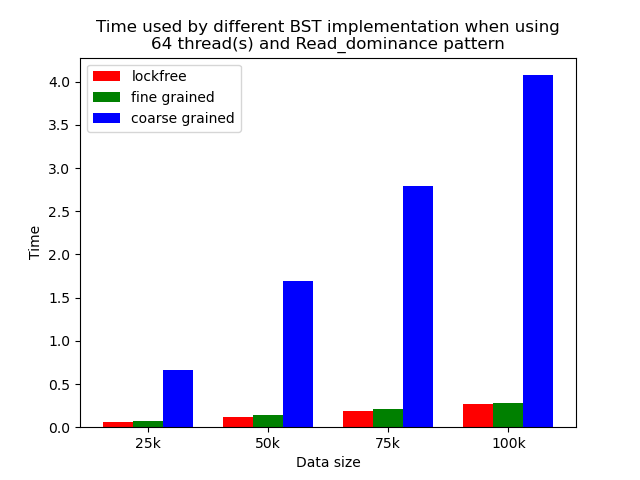 |  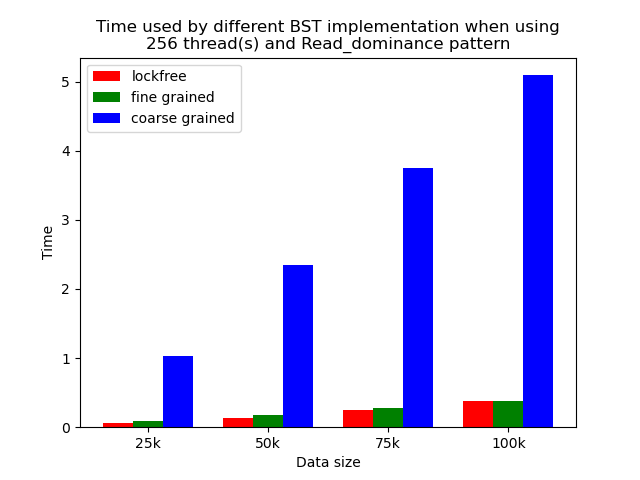 |

#### Conclusion and Analysis
After carrying out the experiments, we draw several conclusions and analyze the reason.
##### Single thread performance
The performance comparison plot when using single thread is shown in the first column of plots in Section 5.2. From the plots, we can see that when there is only 1 thread, the coarse-grained lock protected BST is the fastest, and then lockfree BST is faster than fine-grained lock protected BST in most operation patterns except for the pure erase pattern.
The reason why coarse-grained lock protected BST is the fastest is that when there is only one thread, every operation is serialized naturally. In this case, coarse-grained lock has smallest overhead since it only locks at the beginning of each operation and release the lock after each operation. Fine-grained lock protected BST involves more locking and unlocking operations since it will lock the nodes that are being modified, and there will be more than one pair of locking and unlocking per operation. Therefore, it has the largest overhead. The exception is that lockfree BST is a little bit slower than fine-grained lock protected BST in the pure erase pattern. The possible reason is that the implementation of lockfree BST also involves a lot of flagging and tagging edges and compare-and-swapping, so the overhead can also be very large.
##### Multi-thread performance
When the number of threads is larger than 1, the general trend is that lockfree BST is faster than fine-grained lock protected BST, and fine-grained lock protected BST is faster than coarse-grained lock protected BST, which meets our expectation.
It is clear that coarse-grained lock protected BST is the slowest because it does not allow two operations to access the tree concurrently, so when using coarse-grained lock protected BST, basically all the operations are serialized. Therefore, it will be very slow and actually does not benefit a lot from parallelism. In fine-grained lock protected BST, every node has its own lock, and only nodes that are currently being modified will be locked, so it is truly benefiting from parallelism. However, fine-grained locks bring quite large overhead due to frequent locking and unlocking. Lockfree implementation is avoiding the large overhead by using compare-and-swap instructions before modifying an edge in the tree but not locking all nodes accessed, so the overhead will be smaller while still benefiting from parallelism, and thus lockfree implementation is the fastest.
The difference between coarse-grained lock protected BST and other two types of BST is very large when performing pure search, mixed, and read dominance pattern operations. The reason is that in these three patterns, reading the tree is the dominating operation but not modifying the tree, so fine-grained lock protected BST and lockfree BST is experiencing relatively small overhead, and there will be much less time spent on garbage cleaning. When erase operations are rare, the retire list will be filled up more slowly, and garbage collection happens less frequently. When garbage collecting, the operations on tree will be temporarily blocked, and longer the total execution time. Therefore, less garbage collection means even faster execution. Therefore, in these three operation patterns, fine-grained lock protected BST and lockfree BST will be overwhelmingly faster.
As opposed to pure search, mixed, and read dominance pattern operations, other patterns involve more writing operations, including inserting and erasing. As explained above, in these situations, there will be more lock overhead and/or more garbage collection. Although fine-grained lock protected BST and lockfree BST are still much faster than coarse-grained lock protected BST, the time difference is smaller.
##### Contention
The time plots for the contention simulated pattern when using 64 threads and 256 threads are shown in Fig. 25 and Fig. 26. From the figures, we can see that lockfree BST is still the fastest, followed by fine-grained lock protected BST, and coarse-grained lock protected BST. However, comparing with experiment result in Fig. 20 and Fig. 21, we can see that the time difference is obviously smaller. The operation pattern of the mixed pattern and contention simulated pattern are very similar. The difference is that in contention simulated pattern, we intentionally let multiple threads accessing or modifying same set of tree nodes, but in mixed pattern, each thread will access or modify different tree nodes. Although in the setting of binary tree, contention can still occur even when threads are accessing different set of nodes as they may share common parents, but the chance will be much smaller. We can see that contention does impact the performance. Coarse-grained lock BST is impacted the least as it is suffering from contention all the time. The other two types are impacted more as their performance are closer to the performance of coarse-grained lock BST, but they are still faster.
